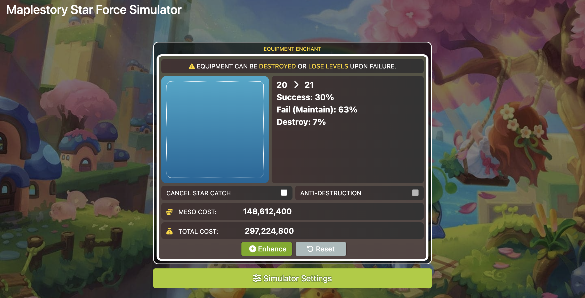

# SOBTECHS - Tools for the games I love

  

#

  <strong>
    A collection of probability calculators and in-game simulators that I've made for the games I play and enjoy.
      
  </strong>
  Visit the website <a href="https://www.sobtechs.dev/">here</a>.

## Showcase

### Maplestory Cubing Tier Chance Calculator

A probability calculator that calculates players' in-game odds to upgrade their equipment given the amount of resources they have. The calculator is implemented using the Markov chain, which is a mathematical model that describes a sequence of events or states, where the probability of each event or state depends only on the previous event or state.

[Full demo here](https://www.sobtechs.dev/cubing.html)

### Maplestory Star Force Simulator

A replica of the Star Force system in the game. 

The Star Force system in MapleStory is a feature that allows players to enhance the power of their equipment. Enhancing equipment with the Star Force system increases its stats, but there is some risk involved if the enhancement fails, which can result in the equipment being destroyed.

[Full demo here](https://www.sobtechs.dev/star_forcing.html)

